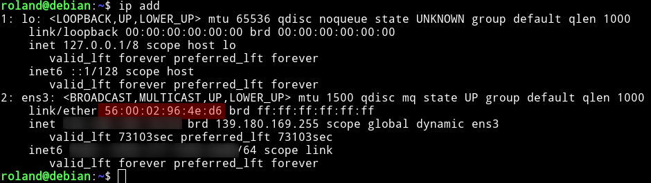
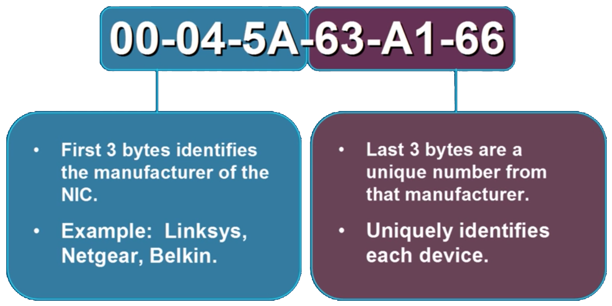

# MAC Addresses

 MAC (media access control address) are a unique identifier for every networked device to identify itself on a network.

* A MAC address is made up of a 6 byte hexadecimal number that is burned into every NIC
* A MAC address can contain any number from A-F and any number

### Checking your MAC address

#### Windows

```
ipconfig /all
```

#### Linux

```
ip address
```


### Identifying a MAC Address

Mac addresses are written in hexadecimal (0-F)

