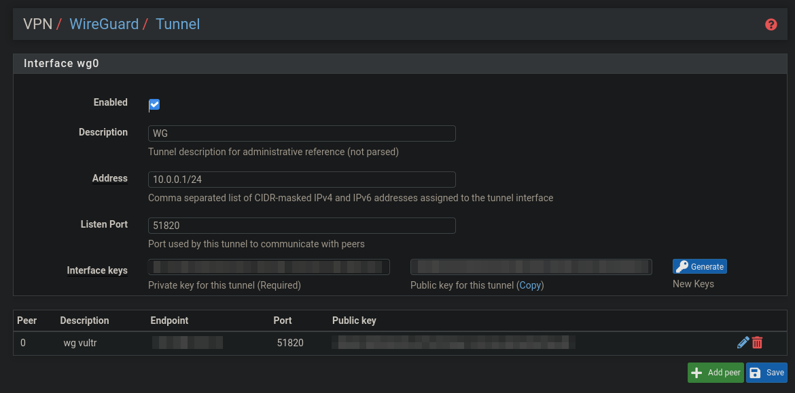
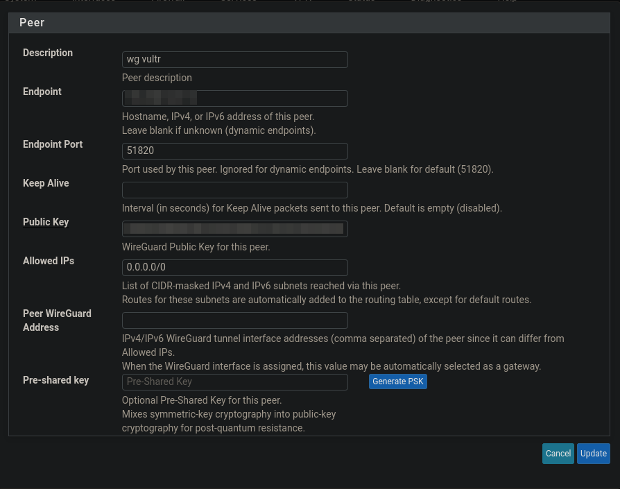
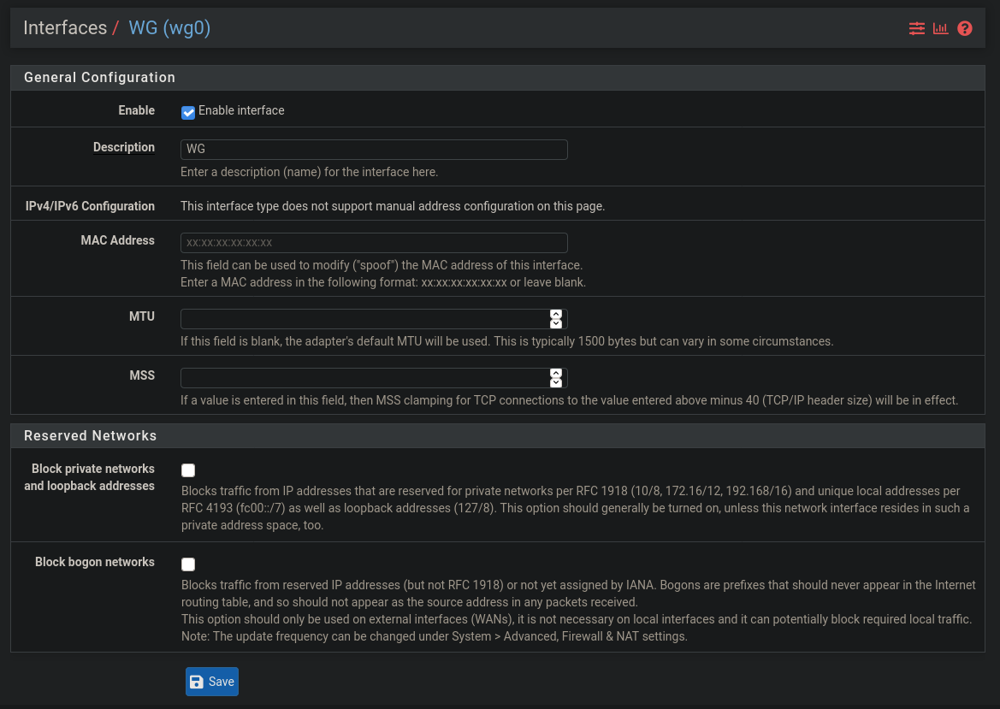
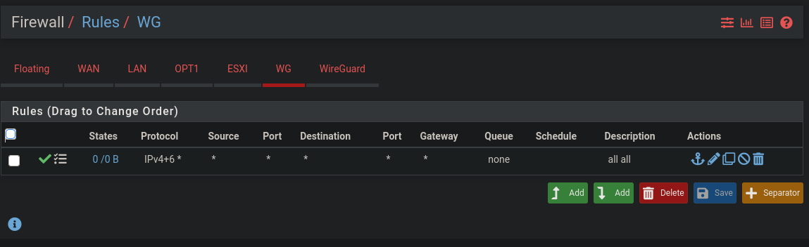
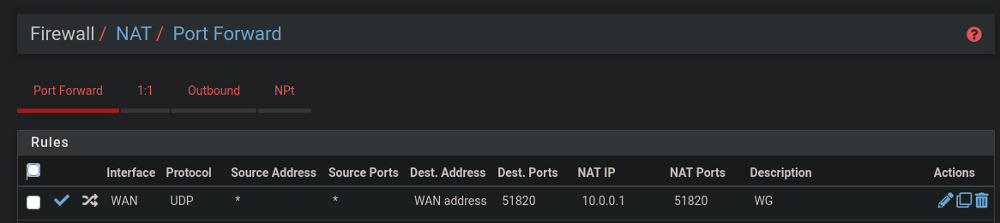

# PFSense

Log of PFSense notes.

## PFBlockerNG

Make sure your DNS servers on linux are actually pointing to your PFSense router.

```none
cat /etc/resolv.conf
```

Check to see if a domain is blocked or not by using the `drill` command from the ldns package.

The result of a non blocked website will return its correct IP from its domain name.

Example of successful domain resolution (domain **isnt** blocked)

```none
drill isitblocked.org
```

```none
;; ANSWER SECTION:
isitblocked.org.	3126	IN	A	74.208.236.124
```

Example of unsuccessful domain resolution (domain **is** blocked).

The returned IP is the virtual IP of PFBlockerNG.

```none
drill analytics.163.com
```

```none
;; ANSWER SECTION:
analytics.163.com.	59	IN	A	10.10.10.1
```

## Captive Portal

Captive portal can be very straight forward to set up.

Start by navigating to `Services -> Captive Portal` and Createing a new one by clicking `Add` and giving it any name and description.

Once created, tick the enable button to see the full list of options

1. Select an interface to apply this to. Be aware that initially devices on this interface will have trouble connecting to the internet, however they should still be able to access the routers address (the IP of my router is 192.168.0.1)
2. Tick `Use custom captive portal page` and Upload a html file under `Portal page contents`

Example of a custom portal page.

```html
<!DOCTYPE html>
<html lang="en">

<head>
	<meta charset="UTF-8">
	<meta name="viewport" content="width=device-width, initial-scale=1.0">
	<title>login</title>
</head>

<body>
	<form method="post" action="$PORTAL_ACTION$">
		<input name="auth_user" type="text" placeholder="name">
		<input name="auth_pass" type="password" placeholder="password">
		<input name="auth_voucher" type="text" placeholder="voucher">
		<input name="redirurl" type="hidden" value="$PORTAL_REDIRURL$">
		<input name="zone" type="hidden" value="$PORTAL_ZONE$">
		<input name="accept" type="submit" value="Continue">
	</form>
</body>

</html>
```

3. Next give any special devices that are outside the DHCP range, but still on the same interface that the captive portal is on special access under `Allowed IP Addresses`.

For example my desktop PC is on my captive portal LAN interface, but outside the DHCP range. DHCP is between 192.168.0.10 - 192.168.0.50 and my PC is on 192.168.0.100, so i add 192.168.0.100 as allowed in both directions.

Another common example is if you are running services like PFBlockerNG that perform DNS filtering, by default the ip address that PFBlockerNG uses as its DNS is `10.10.10.1`. So you need to add this address to the list of allowed IPs (both directions as well) for DNS resolution to work on the captive portal.

More useful debugging information for the captive portal can be found [here](https://docs.netgate.com/pfsense/en/latest/captiveportal/captive-portal-troubleshooting.html).

### Captive portal user authentication

First create a new group under `System -> User Manager -> groups`. Call the group **Captive_Portal** and give it local scope. Next click the *Add* button on the same page and assign the group Captive_Portal group the **User - Services: Captive Portal login** permission.

Now go back to users and create a new user, Make sure to give them a password AND add give them group membership of the Captive_Portal group.

### Captive portal vouchers

Under `Services -> Captive Portal` click edit on your captive portal and then navigate to the vouchers tab.

From the vouchers tab click the enable button and then click save.

Now scroll back up to the top of the vouchers page and you should be able to click the `Add` button to create a new *Voucher Roll*

You can give the roll any number you choose, if you give the new roll the number of a previous roll the old one will be overwritten and delete any unactivated/activated vouchers.

Next pick the minuites per voucher, count (number of vouchers to generate in this particular roll), and an administrative comment.

You can now go back to the main vouchers tab and click the export button on the row for the rolls you just generated.

To test your vouchers copy one from the exported csv and go to `Status -> Captive Portal` and navigate to the `Test Vouchers` tab and paste in a voucher to see its elegibility and time remaining in the database.

### Captive portal custom login page

The captive login page is located at `/var/etc` on the router. To get there, ssh into the router and select option 8 (shell). To copy files you can sftp to your own computer once connected and move images etc over.

Here is an example of a decent looking captive portal page.

```html
<!DOCTYPE html>
<html lang="en">

<head>
	<meta charset="UTF-8">
	<meta name="viewport" content="width=device-width, initial-scale=1.0">
	<title>login</title>
</head>

<body>

	<div id="form-wrapper">
		<form method="post" action="$PORTAL_ACTION$">
			<div id="login-box">
				<input name="auth_user" type="text" placeholder="Name">
				<input name="auth_pass" type="password" placeholder="Password">
			</div>
			<div id="voucher-box" style="display: none;">
				<input name="auth_voucher" type="text" placeholder="voucher">
				<div id="voucher-info">
					
					Vouchers are a single use token that enable access to the internet for a limited time.
				</div>
			</div>
			<input name="accept" id="submit" type="submit" value="Continue">
			<input name="redirurl" type="hidden" value="$PORTAL_REDIRURL$">
			<input name="zone" type="hidden" value="$PORTAL_ZONE$">
			<a href="#" onClick="toggleVoucher(this)" id="toggle-voucher">I have a voucher</a>
			<p id="version">v1.0</p>
		</form>
	</div>

	<style>
		body {
			background-color: #2F303A;
			font-family: 'Roboto', sans-serif;
			margin: 0;
			padding: 0;
		}

		* {
			margin: 0;
			padding: 0;
		}

		#form-wrapper {
			background-color: #585961;
			position: absolute;
			left: 50%;
			top: 50%;
			transform: translate(-50%, -50%);
			justify-content: center;
			margin: auto 0;
			box-shadow: 0 6px 10px black;
			height: 300px;
			width: 300px;
		}

		form {
			margin: 4ch;
		}

		form input {
			box-sizing: border-box;
			margin: 2ch 0;
			width: 100%;
		}

		#toggle-voucher {
			text-decoration: none;
			color: #dedede;
			position: absolute;
			padding: 1ch;
			bottom: 0;
			left: 0;
		}

		#version {
			position: absolute;
			bottom: 0;
			right: 0;
			padding: 1ch;
			margin: 0 auto;
			bottom: 0;
			color: #dedede;
		}
	</style>

	<script>
		const toggleVoucher = (event) => {
			const voucherBox = document.querySelector("#voucher-box");
			const loginBox = document.querySelector("#login-box");

			const voucherIsHidden = (voucherBox.style.display == "block") ? false : true;
			if (voucherIsHidden) {
				voucherBox.style.display = "block";
				loginBox.style.display = "none";
			} else {
				voucherBox.style.display = "none";
				loginBox.style.display = "block";
			}
		}
	</script>
</body>

</html>
```

## PFSense on a laptop

Ie. How to set up PFSense on a device with 1 port using vlans.


### Installing

1. Go to [the website](https://www.pfsense.org/download/) and download the latest version

```none
Version: 2.4.5
Architecture: AMD64 (64bit)
Installer: USB Memstick Installer
Console: VGA
Mirror: Singapore
```

2. Flash image to usb `sudo dd status=progress if=pfSense.img of=/dev/sd[drive]`
3. Follow the install instructions in the installer
4. If you are installing on a laptop (like me) you will likely only have 1 eth port on your laptop, so you will need a switch to facilitate your internet modem, computer and other devices, and your laptop pfsense router. I am using a Cisco 3750 and have connected F0/0/1 -> modem, and F0/0/2 -> laptop router.

### Setting up Basic Configuration

* My current router is on 192.168.0.0/24
* ISP/default gateway (telstra modem) = 192.168.0.1
* Switch LAN IP = 192.168.0.10
* Switch LAN vlan ID = 200
* PFSense WAN = re0.100	no ip
* PFSense LAN = re0.200 192.168.0.200

### Switch Config

```none
vlan 200
	name LAN

int vlan 200
	ip add 192.168.0.10 255.255.255.0

int f1/0/1
	description connection to internet
	switchport mode access
	switchport access vlan 200

int f1/0/3
	description connection to PFSense
	switchport trunk encapsulation dot1q
	switchport mode trunk

! An example interface that you would put a LAN PC on that reports to PFSense
int f1/0/3
	description "put a LAN PC here"
	switchport access vlan 200
	switchport mode access
```

### PFSense Config

1. Create Vlans -> yes
2. Create 2 vlans on your single internet for WAN and LAN
   1. re0.100 = WAN
   2. re0.200 = LAN

Proceed and have PFSense finish setting up the router, you will receive the following IPs

```none
WAN (wan)	-> re0.100	->
LAN (lan)	-> re0.200	-> 192.168.1.1
```

Select option 1 to **assign interfaces** and change re0.200 to an IP that exists on your current network. My current network is using 192.168.0.0/24 so i will change the IP to 192.168.0.200 which will become the new gateway and ip to access PFSense.

```none
WAN (wan)	-> re0.100	->
LAN (lan)	-> re0.200	-> 192.168.0.200
```

You should now be able to connect to 192.168.0.200 (pfsense) from a computer on the 192.168.0.0/24 network. Once logged in go through the setup process and set there values

* Primary DNS = 8.8.8.8
* Secondary DNS = 8.8.4.4
* Enable internal traffic, because the PFSense box is on the inside of the network

### Testing

* You should be able to ping 192.168.0.10 (switch) -> 192.168.0.1 (modem)
* 192.168.0.10 (switch) -> 192.168.0.200 (pfsense) and vice versa
* You should be able to access 192.168.0.200 (pfsense) from a computer connected anywhere on 192.168.0.200

### Setting up SSH to connect to switch

```none
username roland privilege 15 secret p@ssw0rd
ip domain-name Sw4.com
crypto key generate rsa modulus 2048
ip ssh version 2
line vty 0 15
	transport input ssh
	login local
```

### Setting up SSH to connect to PFSense

web interface -> system -> advanced -> Secure Shell.

* Enable Secure Shell = true
* Allow Agent Forwarding = true
* SSHd Key Only = Password or Public Key

### Resolve PFSense using named

After setting up named on my network to resolve some common VM names, i decided to add my pfsense to that list, however i ran into the "potential DNS rebind attack" warning when i set up
an A record for "pf" at its location.

To fix this i renamed the entry in named to "pfsense" which matches the name hostname of the pfsense box. If you want to change the name to something else you can change it under `system -> general`.

Heres a sample for the reverse and forward zones respectively. Just as a reminder.

* reverse: ip -> nameserver
* forward: nameserver -> ip

```sh
; Reverse zone
;
; Router
pfsense	IN	PTR	pf.lab.lan
```

```none
; Forward zone
;
; Router
pfsense		IN	A	192.168.0.1
```

## Wireguard

On the (currently beta) branch of PFSense 2.5.0 RC wireguard (wg) is available as a built in VPN feature with web UI support.

### King of the minimalist VPNs, Balancer of tradeoffs

Wireguard is modern and extremely fast. It consists of only 4,000 lines of codes, making it lean and simple to configure and implement, this is compared to other VPN protocols (mainly IKEv2 and OpenVPN) which have much larger code bases with more features. Wireguard is designed to be a L3 only protocol, relying on third party's for extra bells and whistles, such as second auth factors, see [this video](https://youtu.be/PinVqihuvBQ?t=149) (@2:29) for more on this.

However wireguard like any piece of technology is not without shortcomings. Based on the creators own words from the official [website](https://wireguard.com) you may not want to use wireguard if you care about these things...

1. Deep Packet Inspection - Wireguard does not provide obfuscation to what you are doing, it priorities are on a layer 3 domain only providing strong crypto, whereas obfuscation operates on layers above, this leaves room for third part implementation for obfuscation capabilities.
2. TCP mode - WireGuard explicitly does not support tunneling over TCP, due to the classically terrible network performance of tunneling TCP-over-TCP. If TCP connections are what you need then projects like [udptunnel](https://github.com/rfc1036/udptunnel) and [udp2raw-tunnel](https://github.com/wangyu-/udp2raw-tunnel) are recommended by wireguard to look into.
3. Hardware Crypto - The wireguards ChaCha20Poly1305 crypto suite has lacking hardware support when compared to the more popular AES-NI. However this isn't a big deal according to [here](https://www.wireguard.com/known-limitations/).
4. Roaming Mischief - wireguard is susceptible to MITM attacks
5. Identity Hiding Forward Secrecy - From [wireguard.com](https://www.wireguard.com/known-limitations/) "WireGuard has forward secrecy of data packets, thanks to its handshake, but the handshake itself encrypts the sender's public key using the static public key of the responder, which means that a compromise of the responders private key and a traffic log of previous handshakes would enable an attacker to figure out who has sent handshakes, but not what data is inside of them. Similarly, mac1 is made over the responders public key, which means it is possible to trial hash to guess whether or not a packet is intended for a particular responder, though the mac1 could be forged. Mitigation's include rotating or regenerating keys, based on expectations of un-linkability."
6. Post-Quantum Secrecy - Wireguard is not post-quantum secure
7. Denial of Service - wireguard is supposed to be abuse-resistant through the use of mac1 and mac2, though before mac2 kicks in, the ECDH computations may use considerable CPU. In practice, though, mac2 is usually sufficient.

### How it works

#### Wireguard is connection-less and works different to how other VPNs work

Wireguard is a connection-less protocol, however do not confuse this with stateless as all secure protocols require some state to facilitate a handshake of some kind. Wireguards implementation performs a handshake every couple mins to provide rotating keys and bases the handshake on different internal timers (instead of previous packets).

Wireguards inner workings do not exist in user space, this means there is no systemd unit to turn on and off, and no program to run. Instead wireguard is built into the kernel of linux, and recently freebsd which allows it to exist within PFSense. To "enable" wireguard you instead create a wireguard interface through the `ip` command. For example an example network from the wireguard website cites these following steps to manually configure a peer.

### CLI client instructions - The manual way

Use the video walk through either [here](https://www.wireguard.com/talks/talk-demo-screencast.mp4) as a silent .mp4 or [here](https://youtu.be/88GyLoZbDNw?t=829) (@13:49) as part of a demonstration from blackhat 2018 by one of the creators.

Once connected ping the interface, optionally targeting it with `-I` if required, make sure to name it correctly (from wg0 to anything else you named it).

```none
ping -I wg0 192.168.2.1
```

### CLI client instructions - The wg-quick way

This is the actual way that i would configure a client. Based on [this](https://www.ckn.io/blog/2017/11/14/wireguard-vpn-typical-setup/) tutorial.

#### 1. Install wireguard

Make sure you have buster backports added to `/etc/apt/sources.list` `deb http://deb.debian.org/debian buster-backports main`.

```none
sudo apt update
sudo apt install wireguard-dkms wireguard-tools linux-headers-$(uname -r)
```

Then reboot to avoid the `RTNETLINK answers: Operation not supported` error. Alternatively you can run `modprobe wireguard` to try and load wireguard into the kernel if it supports dkms and wants to play nice (i had trouble doing this so just rebooted instead).

#### 2. Create client keys

Run these commands

Move to the wireguard configuration folder.

```none
cd /etc/wireguard
```

Create the public and private key

```none
wg genkey | tee privatekey | wg pubkey > publickey
```

Set correct permissions for the keys to `600`

```none
chmod 600 privatekey
chmod 600 publickey
```

#### 3. Create client interface config file

Create a config file for wg-quick to read inside `/etc/wireguard/wg0.conf`.

* The client will have the ip 10.0.0.2
* The server that we will connect to is at 101.186.7.12
* The addresses that will use this link is *any* address (0.0.0.0/0)

```none
[Interface]
Address = 10.0.0.2/32
PrivateKey = <private key of this client>
DNS = 1.1.1.1

[Peer]
PublicKey = <public key of the endpoint>
Endpoint = 101.186.7.12:51820
AllowedIPs = 0.0.0.0/0, ::/0
```

#### 4. Running the client

Now you just need to bring the interface up when you would like to use the VPN tunnel. Replace `wg0` with the name of the file in `/etc/wireguard/*.conf`

To bring the interface up.

```none
sudo wg-quick up wg0
```

To bring the interface down.

```none
sudo wg-quick down wg0
```

### Wireguard server - The PFSense way

There is two options, offloading the wireguard server to another computer, or hosting it on PF, of course in this example i will show the PF way of setting up the server using the web UI.

Next under the `System -> Update` tab, make sure you are on 2.5.0 RC at least to see wireguard support under the `VPN` tab. Currently this version is the "next stable version" IE its not quite finished but is near release.

Once on the correct version Wireguard will appear under the VPN tab, no package installation is required.

Next click on the `Add Tunnel` button and fill out the following fields.



* **Description** - Can be anything you want.
* **Address** - the address range of IPs that will used for this tunnel.
* **Listen Port** - Leave this as default (51820) for simplicity.
* **Interface Keys** - Just press "generate" See below for more explanation.

#### Interface keys

The interface keys are a set of public/private keys encoded in base64 that work like SSH keys in that...

* A client has your PF servers public key
* The PF server has your clients public key
* Using these two keys the two nodes are able to establish a secure tunnel

But how is this secure?

* Because we know that asynchronous encryption like the type wireguard uses with public/private keys is a mathematically a **one way** function.
* Because we have keyed in the clients public key into the servers (PFSense) "peers" table, only a client with a private key is able to sign a message that the server can decrypt with its public key.
* This effectively allows the sharing of the public keys, while the private key is kept secret.
* This also works the other way around with the servers private key encoding a message for the client, and the client verifying it came from the server with the servers public key

#### Adding peers

As explained in the interface keys section above, to establish communication __the PF server has your clients public key__. That is the purpose of this table, for registering clients public keys so that we only accept verified messages from the client that could **have only** come from the client because it was encrypted by their private key - a key that only the client owns.

If you would like you can add a Keep Alive of 20s or whatever you feel is a suitable number.

Also not that this type of peer having allowed IPs set to 0.0.0.0/0 is not very secure as it allows any IP on the client to send traffic over this link. A more secure option is to set allowed-ips to the address of the other end of the link, IE 10.0.0.2/32.



#### Observing the newly created interface

After creating the wireguard tunnel we have a brand new interface to use for all wireguard traffic. Observe it under the `Interfaces` tab. No configuration is required here.



#### Creating firewall rules for the wireguard network

Now that we have the wireguard tunnel configured (remember to press save), you should see a new tab under `Firewall -> Rules` for your wireguard network. For testing purposes create an `all all` rule that allows any traffic over this link.



#### Route wireguard traffic to the wireguard interface

The last thing to do is to NAT wireguard traffic to the correct interface (10.0.0.1). Configure a NAT rule until it looks like this.



#### Testing the link

Now go back to "Running the client" and tun the `wg-quick up wg0` command to test your connection.

Running `wg show` should show you the traffic that is going over the link.
