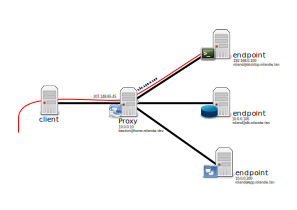

# Bastion Server SSH proxy

A bastion server is a device that faces the internet and is hardened to face attacks. In this example i will set up a bastion server to be used as a ssh proxy.

The ssh proxy will allow outside clients to specify which client they want to connect to. You can read more about this from my source [here](https://www.redhat.com/sysadmin/ssh-proxy-bastion-proxyjump).

A bastion server is an intermediary device that tunnels SSH connections through itself to an internal server.



By default, bastion servers are configured to be accessible from the Internet. The traffic is then translated from the Internet to the internal network. The client is responsible for instructing the proxy server which server to connect to behind it using the ProxyJump `-J` flag.

For the example above in red, the following command would be used.

* bastion.rolandw.lan which is at 10.0.0.12, it runs ssh on port 22.
* my desktop desktop.rolandw.lan is at 192.168.0.100 and also runs ssh on port 22
* from my remote client i can type this command to connect to my desktop.

```none
ssh -J bastion@home.rolandw.dev roland@192.168.0.100
```

This allows the **client** to connect to the **proxy** which connects to the **desktop**.

This can be aliased by adding the following to your `~/.ssh/config` file.

```none
# client ssh config file

Host home.rolandw.dev
  HostName home.rolandw.dev
  User bastion

Host desktop
  HostName 192.168.0.100
  ProxyJump home.rolandw.dev
  User roland
```

When you run `ssh desktop` the ssh client creates a connection to `home.roland.dev` through the *ProxyJump* and then connects to the *HostName* which connects you to 192.168.0.100 via 207.148.85.45.

