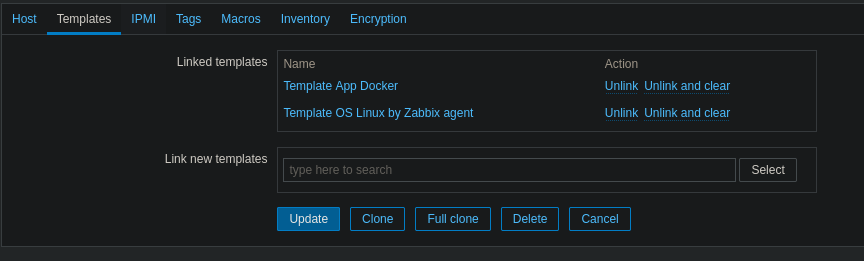

# Zabbix Monitor Docker Containers

To monitor docker you need to use zabbix-agent2.

## Install zabbix-agent2

```none
sudo wget https://repo.zabbix.com/zabbix/5.2/debian/pool/main/z/zabbix-release/zabbix-release_5.2-1+debian10_all.deb

sudo dpkg -i zabbix-release_5.2-1+debian10_all.deb

sudo apt update
```

Then install the agent.

```none
sudo apt isntall zabbix-agent2
```

## Configure zabbix-agent2

Set these options in the `/etc/zabbix/zabbix_agent2.conf` file:

```none
# this is default
PidFile=/run/zabbix/zabbix_agent2.pid

# this is default
LogFile=/var/log/zabbix/zabbix_agent2.log

# change this
LogFileSize=1024

# change this
Server=zabbix.rolandw.lan

# change this
ServerActive=zabbix.rolandw.lan

# this is default
Hostname=system.hostname

# this is default
Include=/etc/zabbix/zabbix_agent2.d/*.conf

# this is default
ControlSocket=/tmp/agent.sock

# change this
TLSConnect=psk

# change this
TLSAccept=psk

# change this
TLSPSKIdentity=store

# change this
TLSPSKFile=/etc/zabbix/psk.key

# change this
Plugins.SystemRun.LogRemoteCommands=1

# change this
Plugins.Docker.Endpoint=unix:///var/run/docker.sock
```

Generate a key for PSK.

```none
sudo openssl rand -hex 32
```

## Zabbix Server Configuration

Then just add the template to your host.


